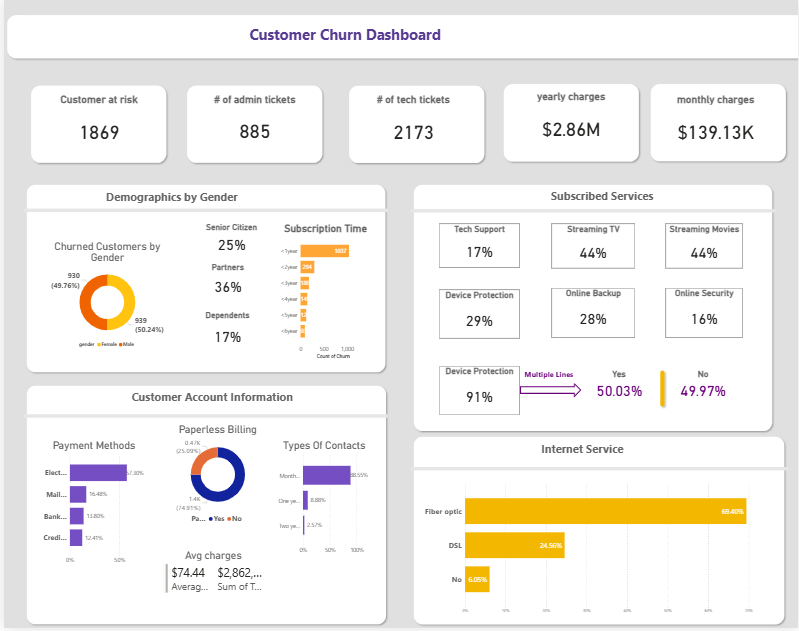
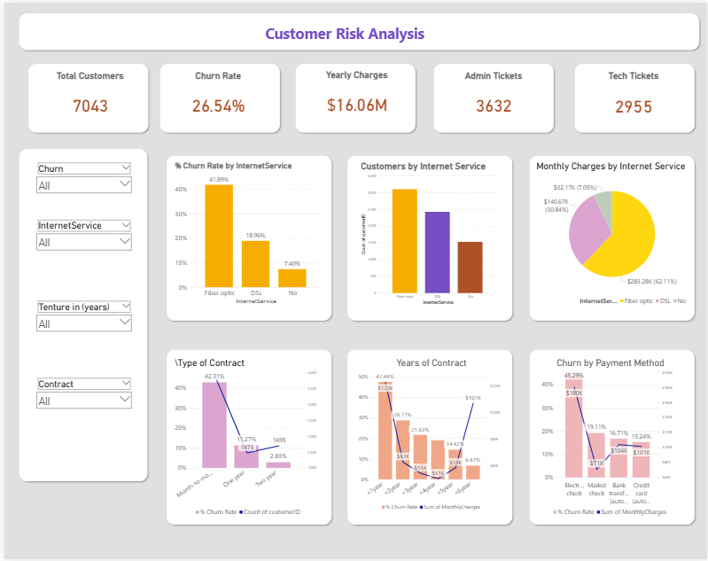
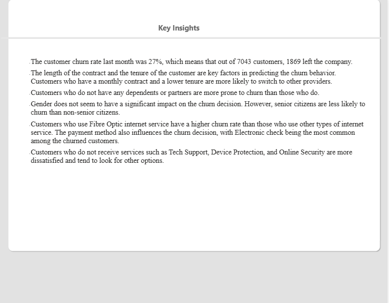

## Customer Retention & Churn Analysis
An interactive Power BI dashboard analyzing customer churn, retention patterns, customer segments, service usage, contracts, and churn risk.

## Project Overview
This project analyzes customer churn and retention patterns using Power BI to understand the customer characteristics and service behaviors associated with attrition.
The dashboard combines customer demographics, contract information, tenure, payment methods, internet services, support services, and billing data to provide an interactive view of customer behavior across different segments.
The analysis is designed to help retention teams identify higher-risk customer segments and evaluate factors associated with customer churn.

## Problem Statement
Customer churn was analyzed as a segmentation and behavioral analysis problem rather than simply as a reporting metric. The objective was to determine which customer characteristics and service patterns were associated with higher churn across the PhoneNow customer base.
The analysis evaluates churn patterns across tenure, contract type, payment method, internet service, demographics, support services, and billing characteristics. These dimensions were transformed into an interactive Power BI analytical model with calculated KPIs and dynamic filtering to compare customer segments and identify concentration of churn risk.
The resulting dashboard provides a structured view of churn drivers and customer segments that can be used to support retention-focused decision-making.

## Business Objectives
- Measure overall customer churn and retention performance
- Identify customer segments with higher churn risk
- Analyze churn patterns across contract types and customer tenure
- Evaluate the relationship between churn and internet services
- Analyze payment methods associated with customer churn
- Understand the relationship between churn and additional support services
- Monitor customer support activity through administrative and technical tickets
- Provide insights to support customer retention strategies

## Tools & Technologies
- **Power BI Desktop** – Customer churn dashboard development and interactive analysis
- **Power Query** – Customer data preparation and transformation
- **DAX** – Churn KPIs and analytical measures
- **Microsoft Excel** – Source customer dataset
- **Data Modeling** – Structuring customer attributes for analytical reporting
- **Interactive Filtering & Segmentation** – Analyzing churn across customer characteristics and service attributes
- **KPI Development** – Monitoring churn rate, customer volume, charges, and support activity
- **Data Visualization** – Communicating churn patterns through interactive charts, cards, and tables

## Dashboard Pages
 ### 1. Customer Churn Overview
Provides an overall view of the customer base, including churn indicators, customer demographics, services, charges, payment methods, contract types, and internet service distribution.

 ### 2. Customer Risk Analysis
Provides detailed analysis of churn patterns across internet service, contract type, tenure, payment method, and monthly charges.
Interactive filters allow users to analyze churn behavior across different customer segments.

 ### 3. Churn Insights
Summarizes the key findings identified from the customer churn analysis, highlighting patterns related to contract duration, tenure, internet service, payment method, and subscribed support services.

## Skills Demonstrated
- Power BI Dashboard Development
- Power Query & Data Transformation
- DAX & Business Calculations
- KPI Development
- Customer Churn Analysis
- Customer Retention Analysis
- Customer Segmentation
- Interactive Data Visualization
- Data Modeling
- Data-Driven Business Analysis

## Project Context
This project was completed as part of the **PwC Switzerland Power BI Job Simulation on Forage**, based on a customer retention and churn analysis scenario for PhoneNow.
The project provided practical experience in Power BI dashboard development, data analysis, visualization, and communicating business insights to stakeholders.

**Note:** This project uses a publicly available customer churn dataset and is presented for portfolio and analytical demonstration purposes
